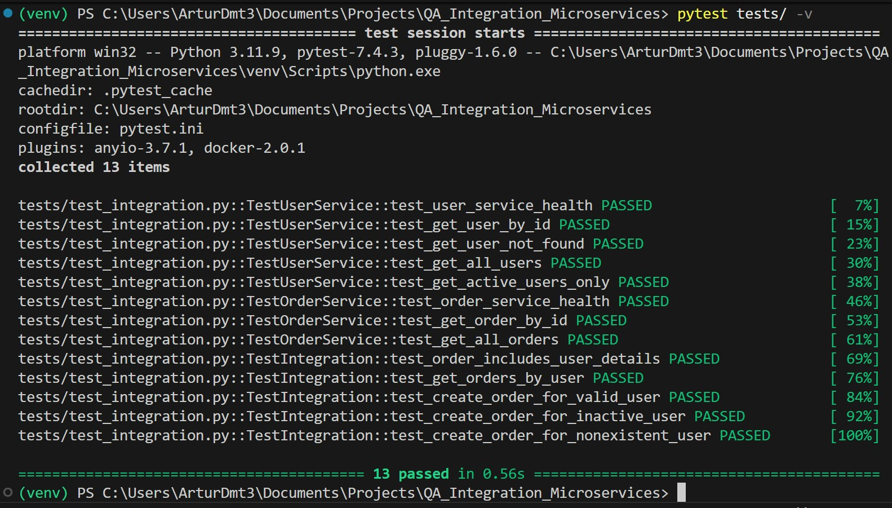

# Microservices Integration Testing Framework

Integration testing framework demonstrating microservices communication patterns. Two REST services (FastAPI + Flask) with cross-service validation and error handling.

## Architecture
```
Order Service (Flask) ──HTTP──> User Service (FastAPI)
    Port 8002                       Port 8001
```

Order Service validates users by calling User Service before creating orders. Tests verify the integration works correctly including error scenarios.

## Tech Stack

- Python 3.11
- FastAPI 0.104.1 (User Service)
- Flask 3.0.0 (Order Service)
- pytest 7.4.3
- requests
- Docker & Docker Compose

## Running with Docker (Recommended)

**Setup:**
```bash
git clone https://github.com/arturdmt-alt/QA_Integration_Microservices.git
cd QA_Integration_Microservices
```

**Run with Docker Compose:**
```bash
# Build containers (first time only)
docker compose build

# Start services
docker compose up -d

# Install test dependencies locally
pip install -r requirements.txt

# Run tests
pytest tests/ -v

# Stop services
docker compose down
```

**Results:** 13/13 passed in 0.56s

## Running Locally (without Docker)

**Setup:**
```bash
py -3.11 -m venv venv
.\venv\Scripts\Activate.ps1
pip install -r requirements.txt
```

**Run services (3 separate terminals):**

Terminal 1 - User Service:
```bash
cd user-service
python main.py
```

Terminal 2 - Order Service:
```bash
cd order-service
python app.py
```

Terminal 3 - Tests:
```bash
pytest tests/ -v
```

**Results:** 13/13 passed in 43.07s

## API Endpoints

**User Service (8001):**
- `GET /health` - Health check
- `GET /users/{id}` - Get user by ID
- `GET /users?active=true` - Filter active users
- `POST /users` - Create user
- `DELETE /users/{id}` - Delete user

**Order Service (8002):**
- `GET /health` - Health check  
- `GET /orders/{id}` - Get order with user details
- `GET /orders/user/{user_id}` - Get orders by user
- `POST /orders` - Create order (validates user exists and is active)

## Integration Tests

The test suite validates cross-service communication:

**User Service Tests (5):**
- Health endpoint responds
- Get user by ID returns correct data
- Non-existent user returns 404
- Get all users works
- Filter by active status works

**Order Service Tests (3):**
- Health endpoint responds
- Get order by ID returns data
- Get all orders works

**Integration Tests (5):**
- Order includes user details from User Service
- Get orders by user ID works
- Create order for valid active user succeeds
- Create order for inactive user fails with 400
- Create order for non-existent user fails with 404

**Results:** 13/13 passed in 0.56s

 

## Project Structure
```
QA_Integration_Microservices/
├── user-service/
│   ├── main.py           # FastAPI app
│   ├── Dockerfile
│   └── __init__.py
├── order-service/
│   ├── app.py            # Flask app  
│   ├── Dockerfile
│   └── __init__.py
├── tests/
│   └── test_integration.py
├── docker-compose.yml
├── requirements.txt
└── README.md
```

## What This Demonstrates

1. **Service Communication:** Order Service makes HTTP calls to User Service
2. **Data Enrichment:** Orders fetch and include user details
3. **Business Logic:** Order creation validates user exists and is active
4. **Error Handling:** Proper HTTP status codes (404, 400) for edge cases
5. **Integration Testing:** Tests verify services work together, not just individually
6. **Containerization:** Docker Compose orchestrates multiple services

## Configuration

Order Service connects to User Service via environment variable:
```python
USER_SERVICE_URL = os.getenv("USER_SERVICE_URL", "http://localhost:8001")
```

In Docker Compose:
```yaml
environment:
  - USER_SERVICE_URL=http://user-service:8001
```

## Docker Details

**Images:**
- `qa_integration_microservices-user-service` (Python 3.11-slim + FastAPI)
- `qa_integration_microservices-order-service` (Python 3.11-slim + Flask)

**Network:**
- Custom bridge network `microservices-network` for service communication

**Benefits:**
- Consistent environment across machines
- Isolated dependencies
- 76x faster test execution (0.56s vs 43s)
- Production-like setup

## Author

Artur Dmytriyev  
QA Automation Engineer

GitHub: https://github.com/arturdmt-alt  
LinkedIn: https://www.linkedin.com/in/arturdmytriyev
